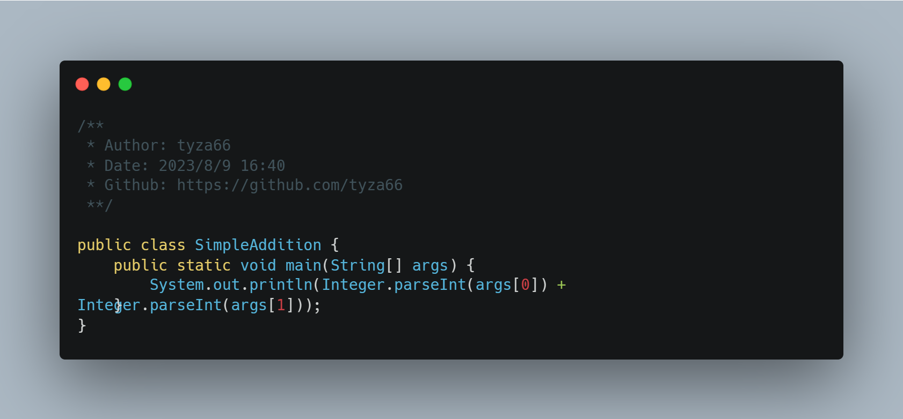
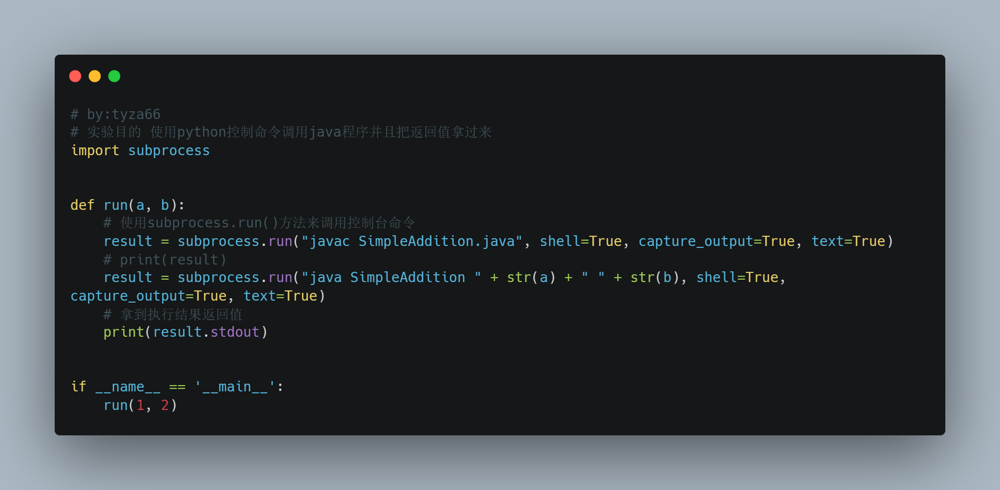
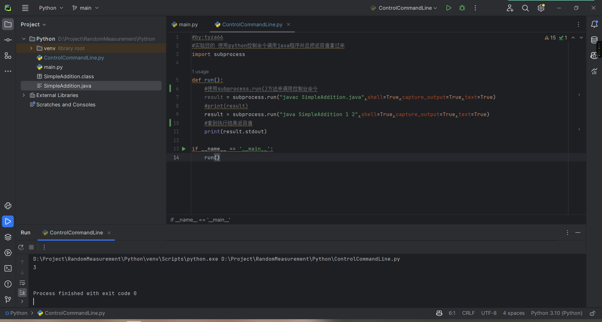

# [技术分享][001期]不同编程语言之间如何通信合作！分布式只是其中一种情况！
### 一、前言
- 我们学过C、Java、Python、Golang、Ruby...等等高级语言，它们都有自己的优点、特性、语法。你是否想过诸如这样的问题：这些高级语言之间有什么关系、有什么共性、如何只发挥自身优势规避劣势、如何相互协调合作、如何互相通信呢？
- 本文主要讲述的是不同编程语言之间如何通信（同语言不同服务器间依然适用），从而渐渐解释上面提到的一系列问题。
- 有的同学看到这里可能就要翻走了，觉得这篇文章要说的*这个东西*不就是分布式吗，这东西咱早会了，玩的肯定比你溜...但是！我要说并不只是分布式，而是本质上的东西，分布式只是其中的一种实现方式，还请您看我细细道来。
- 其实我们在日常使用计算机的过程中，非常*常见*地，就已经在使用不同编程语言相互协调合作相互通信的机制了，举几个最直观的例子：Docker是使用Go语言编写的，但是我们在Docker容器中可以使用Python、Ruby、Java等语言编写的程序、Java编译器最初是使用C语言编写的、Java虚拟机HotSpot是用C++语言编写的、消息队列支持不同编程语言之间通信、项目中不同服务之间相互请求...
- 这样做的好处显而易见：方便开发、方便跨平台、方便分配性能...
- 咋回事呢？我这里提出两个四字词语作为关键词：`协调合作`、`共同语言`

### 二、思路
- 日常生活中，我们人类之间的交流方式多种多样，语言、肢体语言、书面文字、手机发消息、视频通话...这些都是我们人类之间的通信方式，但是我们并不是每一种通信方式都会使用，而是根据场景、目的、效率等因素来选择合适的通信方式。
- 这些交流方式要分类的话，可以通过`层面`进行分类为：书面、口头、视觉、电子介质...。同理，在计算机程序上，也有很多的交互`层面`，比如：内存层面、变量作用域层面、网络层面、文件层面、进程层面、线程层面、硬件层面...。我们可以通过这些层面来进行分类和组合，然后再根据场景、目的、效率等因素来选择合适的通信合作方式。
- 在同一个层面下，不同的编程语言或不同的程序之间的协作要么依靠`协调合作`，要么依靠`共同语言`。说白了就是约定好合作方式，然后按照约定的方式进行合作。`协调合作`比如多个程序之间处理各自部分（各系统之间可以没有请求关系）使得最终的结果是预期的结果。`共同语言`比如：Java程序和Python程序之间的通信，可以通过约定好的文件格式、网络协议、内存格式、序列化方式等方式进行通信。

### 三、实现例子
- 以系统控制台为媒介（操作系统层面、通过共同语言交互）：如果您平时使用的操作系统是Windows，其实很容易想到，只要拿到一个命令行窗口，就可以对电脑做几乎任何操作，包括应用程序的启动、关闭、文件的读写、网络的请求等等。那么编程语言可以拿到命令行吗？答案是肯定的。并且只要编程语言可以调用操作系统的API（大多数编程语言都支持），拿到命令行，然后就可以对电脑做任何操作了。借助这一特性，我们可以在不同编程语言之间进行通信合作，比如：Python调用操作系统API拿到命令行，然后执行Java程序，Java程序执行完毕后，将结果返回给Python程序，Python程序再将结果返回给用户。这样就实现了Python和Java之间的通信合作。
    - Java代码
        
    - Python代码
        
    - 运行结果
        
- 以文件系统为媒介（操作系统层面、通过共同语言交互）：一般我们常见的操作系统都具有文件管理的功能。恰巧的是，高级语言中一般也都有编辑文件使用的库