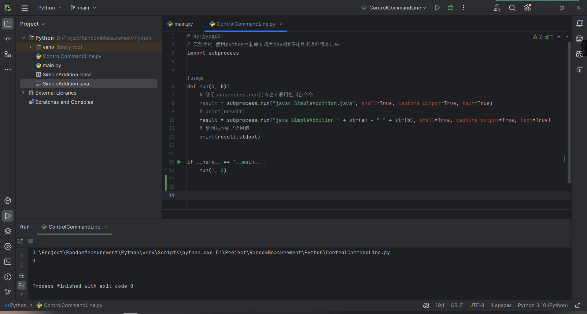
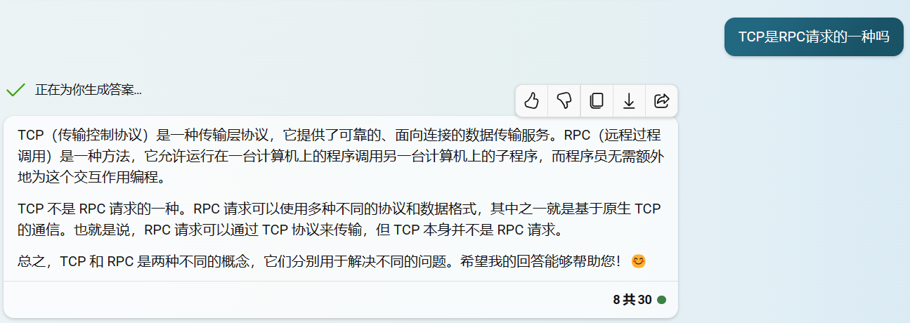

# [技术分享][001期]不同编程语言之间如何通信合作！分布式只是其中一种情况！
### 一、前言
- 我们学过C、Java、Python、Golang、Ruby...等等高级语言，它们都有自己的优点、特性、语法。你是否想过诸如这样的问题：这些高级语言之间有什么关系、有什么共性、如何只发挥自身优势规避劣势、如何相互协调合作、如何互相通信呢？
- 本文主要讲述的是不同编程语言之间如何通信（同语言不同服务器间依然适用），从而渐渐解释上面提到的一系列问题。
- 有的同学看到这里可能就要翻走了，觉得这篇文章要说的*这个东西*不就是分布式吗，这东西咱早会了，玩的肯定比你溜...但是！我要说并不只是分布式，而是本质上的东西，分布式只是其中的一种实现方式，还请您看我细细道来。
- 其实我们在日常使用计算机的过程中，非常*常见*地，就已经在使用不同编程语言相互协调合作相互通信的机制了，举几个最直观的例子：Docker是使用Go语言编写的，但是我们在Docker容器中可以使用Python、Ruby、Java等语言编写的程序、Java编译器最初是使用C语言编写的、Java虚拟机HotSpot是用C++语言编写的、消息队列支持不同编程语言之间通信、项目中不同服务之间相互请求...
- 这样做的好处显而易见：方便开发、方便跨平台、方便分配性能...
- 咋回事呢？我这里提出两个四字词语作为关键词：`协调合作`、`共同语言`

### 二、思路
- 日常生活中，我们人类之间的交流方式多种多样，语言、肢体语言、书面文字、手机发消息、视频通话...这些都是我们人类之间的通信方式，但是我们并不是每一种通信方式都会使用，而是根据场景、目的、效率等因素来选择合适的通信方式。
- 这些交流方式要分类的话，可以通过`层面`进行分类为：书面、口头、视觉、电子介质...。同理，在计算机程序上，也有很多的交互`层面`，比如：内存层面、变量作用域层面、网络层面、文件层面、进程层面、线程层面、硬件层面...。我们可以通过这些层面来进行分类和组合，然后再根据场景、目的、效率等因素来选择合适的通信合作方式。
- 在同一个层面下，不同的编程语言或不同的程序之间的协作要么依靠`协调合作`，要么依靠`共同语言`。说白了就是约定好合作方式，然后按照约定的方式进行合作。`协调合作`比如多个程序之间处理各自部分（各系统之间可以没有请求关系）使得最终的结果是预期的结果。`共同语言`比如：Java程序和Python程序之间的通信，可以通过约定好的文件格式、网络协议、内存格式、序列化方式等方式进行通信。

### 三、实现例子
- 以人肉为媒介（客观世界层面、通过协调合作和共同语言）：顾名思义，直接让人用眼睛看，再录入！这个方法虽然正常人都能想到，但是我还是要写一下！人能做的事情其实随着技术发展，机器将来也可以做！因此可以联想到：OCR、自动化脚本、AI...
    - 
- 以系统控制台为媒介（操作系统层面、通过共同语言交互）：如果您平时使用的操作系统是Windows，其实很容易想到，只要拿到一个命令行窗口，就可以对电脑做几乎任何操作，包括应用程序的启动、关闭、文件的读写、网络的请求等等。那么编程语言可以拿到命令行吗？答案是肯定的。并且只要编程语言可以调用操作系统的API（大多数编程语言都支持），拿到命令行，然后就可以对电脑做任何操作了。借助这一特性，我们可以在不同编程语言之间进行通信合作，比如：Python调用操作系统API拿到命令行，然后执行Java程序，Java程序执行完毕后，将结果返回给Python程序，Python程序再将结果返回给用户。这样就实现了Python和Java之间的通信合作。反之亦然。
    - Java代码
        
    - Python代码
        
    - 运行结果
        

- 以文件系统为媒介（文件层面、通过共同语言交互）：一般我们常见的操作系统都具有文件管理的功能。恰巧的是，高级语言中一般也都有编辑文件使用的库，我们可以直接通过编程语言对系统中的文件和文件夹进行读写操作，并且文件的内容（就是不同编程语言之间交互用到的`共同语言`）由我们开发者来自己规定。这里我举一个小例子，首先我们在系统上有一个公共可以访问的文本文档，在Java程序中我们封装了了一个工具类专门用来读写文本文件的最后几行（要执行的命令），Python之中我们也是通过调用文件操作来实现文件读写。并且我们规定文件的每一行都是一条指令，使用`,`分割当条指令的各部分，并且我将每一条指令分为三部分，第一部分是指令，第二部分是参数（如果是多参数就可以用特定符号分割，如果各部分之间的分隔符与参数冲突可以通过固定指令和是否被执行完参数的长度来控制），第三部分是指令是否被执行完（也就是说，用户可以同时发布多条指令）。
    - Java代码
        
    - Python代码
        
    - 执行效果
        
        

- 以时间分片为媒介（客观世界层面、通过协调合作交互）：时间分片这个事情其实并不用多说什么，理解起来也容易。我们常将时间比作一条线，叫做时间线，这种方式的介绍也由此展开介绍。在时间线上发生的事件有这几种关系：交替、并行、半交替半并行等，总之就是可以一起执行，可以分开执行。一起执行的话（后两种）想要在各个服务程序中想要通信，这种方法只适用于部分场景（取决于选择的长期纯粹介质），这条例子中主要说的是交替执行。按时间分片交替执行其实是我们最直观的相同编程语言、不同变成语言之间交互的方式，这种方式的精髓在于一个程序执行完成之后，必然会通过长期存储介质将信息保存（可以是纸带、文件、二进制流、图片等），之后下一个时间片中的程序再去约定好的地方将上一个程序传递过来的信息读取解析，然后再根据信息执行自己的任务，之后再通过长期存储介质将自己想传递出去的信息传递回去...我们常见的使用这种方式的地方就是在网关分布式程序（就是通过网关实现一系列执行同样业务的服务器的负载均衡等操作）中使用到的Redis共享Session，在这种模式下就属于以时间片为媒介的同种高级语言（可以不同种）交替执行。在同一个时间线上，一个请求打到网关上的时候，会经过负载均衡机制将请求分给网关下面的单台服务器，这些服务器因为是使用的共享的数据源，所以用户端看起来就是一台服务器（不会出现数据偏差）。
    - 
    - 
  
- 以语言中间件为媒介（框架层面、通过共同语言）：其实很多编程语言都有直接调用其他编程语言代码的库（这些库的底层原理可能是走的其他交互方式，但是我在这个层面介绍这些），比如Matlab能调用Python代码、Python也能调用Matlab的代码调用的分别都是自身语言下的库或和其他语言功能，比如在Python中使用Jpype调用Java程序...
    - Python调用Matlab
        
    - Python调库运行Java代码
        
        
        
- 以消息队列为媒介（框架层面、通过共同语言）：不管消息队列是现成的还是自己实现的，不管它有多少高级又神奇的功能，本质上，能实现通信合作的原因就是这一个！传递的是字符串！一般使用消息中间件的情况下，消息是先从程序发送到消息队列中间件，之后经过消息队列中间（可以有逻辑或规则）件被其他程序（可以是相同语言或不同语言实现的）调库获得消息信息并处理。
    - 
- 以网络请求为媒介（网络层面、通过共同语言）：这个方法是最常见的了！比如我们自己写的普通BS和CS结构的程序就一直在用！我一说您可能就会明白。首先后端程序语言就很多样，其次前端程序语言也有很多选择！没看懂？那再换个说法，假如说后端用Java、前端用三件套（HTML+CSS+JS），是不是！不同编程语言合作了！这种合作是通过请求API实现的，后端暴露特定请求可访问的API，前端向这些API按约定的方式发起请求。现在比较火爆的分布式技术（简单说就是服务器之间可以相互发请求、实现协作、实现负载均衡，有时是直接发请求、有时是通过RPC实现）就是这个原理。分布式中的这种合作也是通过暴露API或者使用RPC（远程过程调用）的形式直接调用其他后端程序中的方法。这里举个例子，在我的这个开源文件管理项目中我是用到Python语言作为功能支撑（方便好写），Java语言作为核心支撑（稳定性强）。可以看到，我这里在Python后端使用FastApi提供Get请求接口，在Java后端使用SpringBoot-Web中提供的RestTemplate调用Python提供的，这样就实现了Python和Java之间的通信合作，并且如果我们使用网关的话，这种结构可以实现水平拓展型能的负载均衡。再举个其他冷门搭配的例子，在我另一个开源项目中，使Golang去调用硬件芯片上提供的API（用C编写的），这样就实现了Golang和硬件芯片之间的通信合作。
    - 分布式实现的文件管理项目中Java调用Python代码片段（FileAndFolderUtil.java第262行）
        
        
    - 绿植管理项目中Golang调用硬件上C提供的API代码片段（GreenBeltGoRun.go）
        

### 四、难点
- 
- 
- 

### 五、看代码
- 控制台交互Python：https://github.com/tyza66/RandomMeasurement/blob/main/Python/ControlCommandLine.py
- 控制台交互Java：https://github.com/tyza66/RandomMeasurement/blob/main/Python/SimpleAddition.java
- 通过文件交互Java：https://github.com/tyza66/RandomMeasurement/blob/main/Java/src/main/java/org/example/CollaborateThroughDocuments.java
- 通过文件交互Python：https://github.com/tyza66/RandomMeasurement/blob/main/Python/CollaborateThroughFileOperations.py
- 通过文件交互用的文件：https://github.com/tyza66/RandomMeasurement/blob/main/Java/src/main/java/org/example/testTranslate.txt
- Jpype：https://jpype.readthedocs.io/en/latest/
- 测试Jpype用的Java代码：https://github.com/tyza66/RandomMeasurement/blob/main/Java/src/main/java/org/example/Jtest.java
- 测试Jpype用的Jar包：https://github.com/tyza66/RandomMeasurement/tree/main/Java/jar/Jtest
- 测试Jpype用的Python代码：https://github.com/tyza66/RandomMeasurement/blob/main/Python/RunningJavaByJpype.py
- 分布式实现的文件管理项目：https://github.com/tyza66/VA-File

### 六、总结
- 不同编程语言相互调用，其实是我们经常使用的开发模式。但是这种模式带来的便利往往被我们忽略掉。日常开发中经常会遇到`通过这种方式可以便捷解决`的需求，这种方式能够很有效的避免`代码完全重构`、`跨语言扒库`等等问题。
- 感谢您能耐心看完这篇文章，如果有什么问题，欢迎在评论区留言，我会尽快回复。
- 如果您觉得写的还不错，欢迎关注、点赞、分享、订阅、Star，您的点赞是我写作的动力。